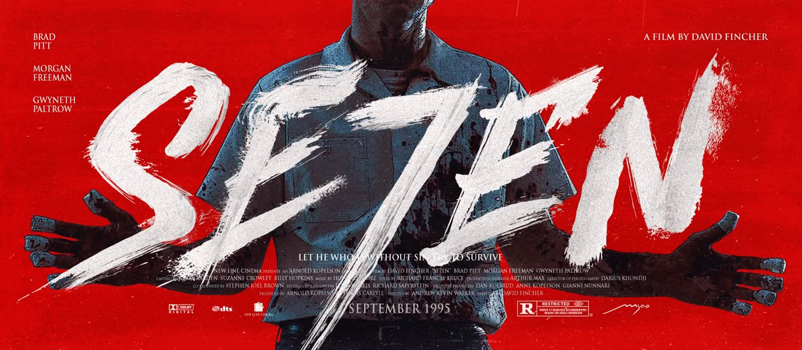

  

  &nbsp;
  &nbsp;
  &nbsp;
  &nbsp;
  

---

<table>
<tr>
<td valign="top" height="50%" width="50%" align="center">
  
</td>
<td valign="top" width="50%">

### Sri Krishna V

Agentic AI Developer | Open Source Enthusiast | Tech Explorer

**250+ stars** on [awesome-adk-agents](https://github.com/Sri-Krishna-V/awesome-adk-agents)

GitHub: Starstruck ×2 · Quickdraw · Pull Shark

[@North-Of-Ordinary](https://github.com/North-Of-Ordinary) · [@SupaNovaTech](https://github.com/SupaNovaTech) · [@ELITE-Club-Amrita](https://github.com/ELITE-Club-Amrita) 

</td>
</tr>
</table>

---

## Tech Stack

  

---

## Projects

**AI · Agents · LLM**

| Project | Description |
|---|---|
|  | Curated ADK agent templates, best practices & production-ready examples — 262 stars |
|  | Agentic Generative UI: NL → production-ready React apps via Tambo agents + MCP |
|  | Full-stack agent-powered data analytics with CrewAI & Firecrawl |
|  | AI platform generating regulation-aware test cases from requirement docs (RAG + KG + FastAPI) |
|  | Intelligent doc search & retrieval with Haystack AI, Gemini 2.5 & Qdrant |
|  | Agentic Unit Tester — TypeScript |
|  | Gemma3n fine-tuned on Openthoughts3 1.2M for critical thinking |

**Full-Stack · Apps · Tools**

| Project | Description |
|---|---|
|  | Academic research collaboration — FastAPI, Neo4j, Next.js, sentence transformers |
|  | Chrome extension for web accessibility — on-device LLM via WebGPU, zero cloud |
|  | Stunning 3D isometric system design / architecture diagrams |
|  | My own programming language inspired by Python |
|  | Maze generator & solver — DFS, BFS, A\*, Dijkstra |
|  | Library management system — CLI + REST API + FastAPI + PostgreSQL |
|  | Bingo web app — React + TypeScript + Vite |

---

## Contributions

  

  <picture>
    <source media="(prefers-color-scheme: dark)" srcset="https://raw.githubusercontent.com/Sri-Krishna-V/Sri-Krishna-V/output/github-snake-dark.svg"/>
    <source media="(prefers-color-scheme: light)" srcset="https://raw.githubusercontent.com/Sri-Krishna-V/Sri-Krishna-V/output/github-snake.svg"/>
    
  </picture>

---

  

