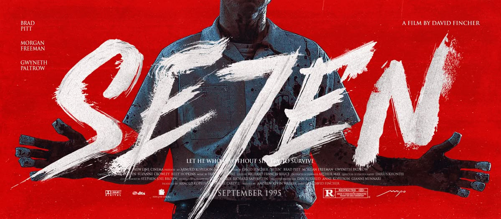
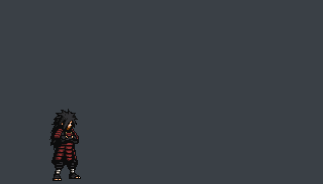
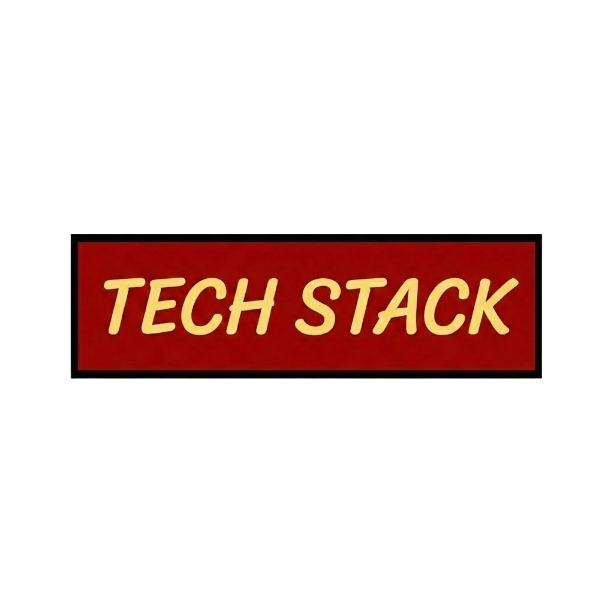
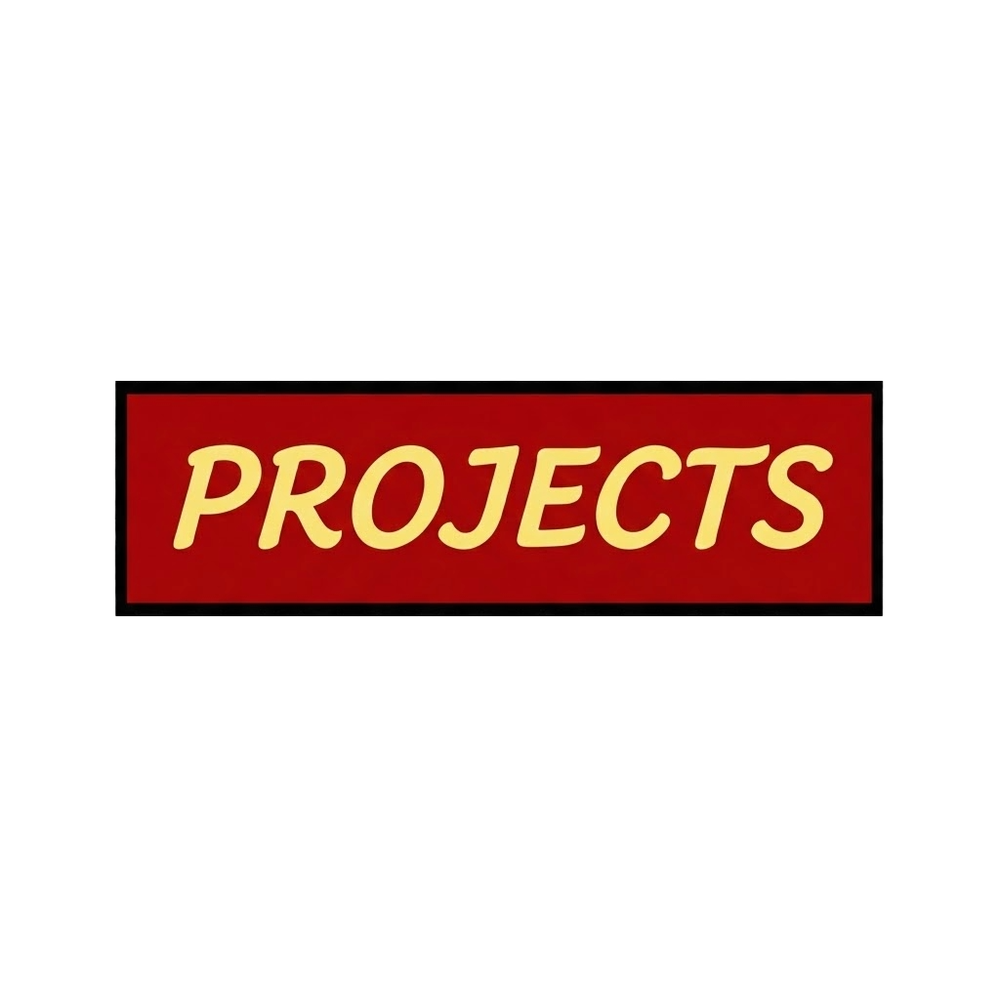
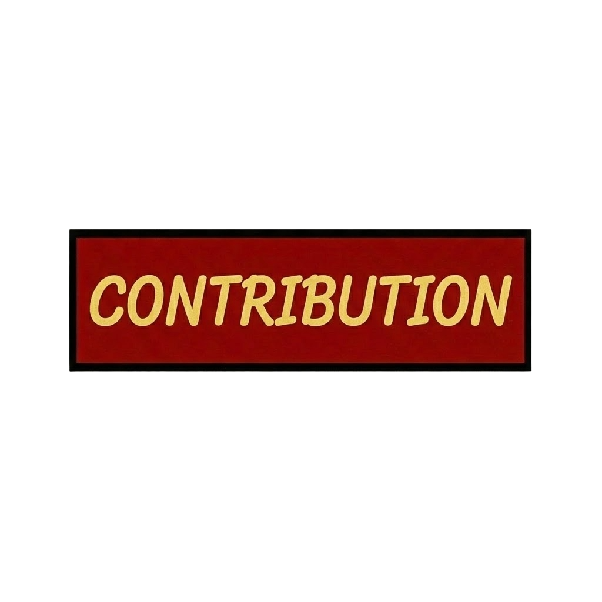
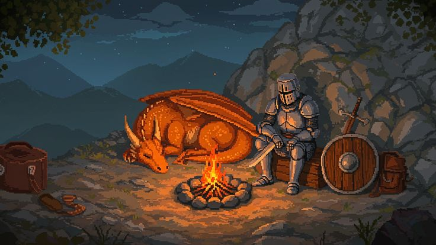

  

  &nbsp;
  &nbsp;
  &nbsp;
  &nbsp;
  

---

<table>
<tr>
<td valign="top" height="50%" width="50%" align="center">
  
</td>
<td valign="top" width="50%" align="center">

   
  the agents do the work. i take the blame.

**336 stars · 49 forks** on [awesome-adk-agents](https://github.com/Sri-Krishna-V/awesome-adk-agents)

GitHub: Starstruck ×2 · Pull Shark ×2 · Pair Extraordinaire ×2 · Quickdraw · YOLO

Member of [@IDEA-Amrita](https://github.com/IDEA-Amrita) · [@North-Of-Ordinary](https://github.com/North-Of-Ordinary) · [@SupaNovaTech](https://github.com/SupaNovaTech) · [@ELITE-Club-Amrita](https://github.com/ELITE-Club-Amrita)

Chennai · Amrita Vishwa Vidyapeetham, Coimbatore

</td>
</tr>
</table>

---

   
  

---

   

**Systems · Security · Observability**

| Project | Description |
| --- | --- |
|  | Endpoint sensor for AI coding agents: normalizes hooks, OTLP & on-disk transcripts from 27 agents into one event model, 51 CEL detection rules, blocks an action before it runs. Written in Go |
|  | Enterprise Research OS: continuously ingests public financial knowledge into a graph-linked platform with full provenance. Python 3.12, Postgres 16 + pgvector, FastAPI |

**AI · Agents · LLM**

| Project | Description |
| --- | --- |
|  | Curated Google ADK agent templates, best practices & production-ready examples. 336 stars, 49 forks |
|  | Agentic Generative UI: natural language → production-ready React apps via autonomous Tambo agents, MCP codebase grounding & E2B sandboxed execution |
|  | AI career development assistant: CrewAI multi-agent system, mem0 long-term memory, Firecrawl web intelligence & LiveKit voice interviews |
|  | AI platform generating regulation-aware, traceable test cases from requirement docs for healthcare & regulated industries |
|  | Full-stack agent-powered data analytics with CrewAI & Firecrawl |
|  | Intelligent document search & retrieval with Haystack AI, Gemini 2.5 & Qdrant |
|  | Chrome extension making any web article accessible: on-device LLM via WebGPU, zero cloud, zero backend. Built for dyslexia, ADHD & low vision |

**Research · ML**

| Project | Description |
| --- | --- |
|  | IEEE 118-bus fault detection with a hybrid CNN-LSTM architecture: 95%+ accuracy across 70 fault scenarios under varying noise. TensorFlow 2.17 |
|  | Offline speech → Indian Sign Language translator, optimised for Raspberry Pi 4B. Python, FastAPI, React & Three.js avatar |
|  | Gemma 3n fine-tuned on OpenThoughts3 for critical reasoning, with a live [Critical Thinker](https://huggingface.co/spaces/anhsirk/critical-thinker) Space |
|  | InternVL fine-tuned on SLAKE for medical visual question answering, 0.9B params |
|  | Solar energy output prediction with classical ML regressors |

**Languages · Compilers · Algorithms**

| Project | Description |
| --- | --- |
|  | Java → Go transpiler: DFA lexer, LL(1) recursive-descent parser over a CFG, AST construction & visitor-pattern codegen |
|  | My own programming language, inspired by Python |
|  | Maze generator & solver: DFS, BFS, A\*, Dijkstra |

**Apps · Platforms · Tools**

| Project | Description |
| --- | --- |
|  | Academic research collaboration: semantic mentor-matching via FastAPI, Neo4j graph DB, Next.js & sentence-transformer embeddings |
|  | Cloud-native study session tracker & goal platform: serverless edge functions, Kubernetes orchestration, Supabase + PostgreSQL, CI/CD |
|  | Real-time fire safety monitoring: ESP32/MQ-6, ESP8266/DHT11 & Pico W/PIR doing edge filtering (EMA, ROC, delta-publish) → MQTT → Node-RED |
|  | Mobile finance & receipt management app, built with Flutter |
|  | AI-powered agricultural intelligence platform, for the farmers 🌽 |
|  | Desktop food ordering app: PyQt6 + SQLite |
|  | RevSin: library management with interactive CLI, REST API & automated loan tracking. FastAPI + PostgreSQL |
|  | Browser audio visualisation off the Web Audio API |
|  | Bingo web app: React + TypeScript + Vite |
|  | Full-stack food delivery system, built to teach myself OOP |
|  | Workshop I ran on containerizing a full-stack app: Dockerfiles, Compose, container networking, Docker Hub |

**Hackathons · Collaborations**

| Project | My share | What it is |
| --- | --- | --- |
|  | 49 commits | Devtrails Guidewire Hackathon '26 with Mog Squad. Automatic income-continuity safety net, zero paperwork. Flutter + Node/Express + Python/FastAPI |
|  | lead | Agentic decision support for electricity procurement & IEX/DAM trading at Kerala State Electricity Board: 96-block day-ahead plans, MILP dispatch, digital-twin validation, RL fine-tuning. Final-year project |
|  | 2nd | Real-time agent querying live courtroom video at sub-500ms: Stream, Twelve Labs, Deepgram & Gemini Live |
|  | 3rd | Self-learning data agent delivering insights, not SQL. 6 layers of context grounding. MCP, FastAPI, Postgres + pgvector, Gemini |

---

   
  

  <picture>
    <source media="(prefers-color-scheme: dark)" srcset="https://raw.githubusercontent.com/Sri-Krishna-V/Sri-Krishna-V/output/github-snake-dark.svg">
    <source media="(prefers-color-scheme: light)" srcset="https://raw.githubusercontent.com/Sri-Krishna-V/Sri-Krishna-V/output/github-snake.svg">
    
  </picture>

---

  

  

